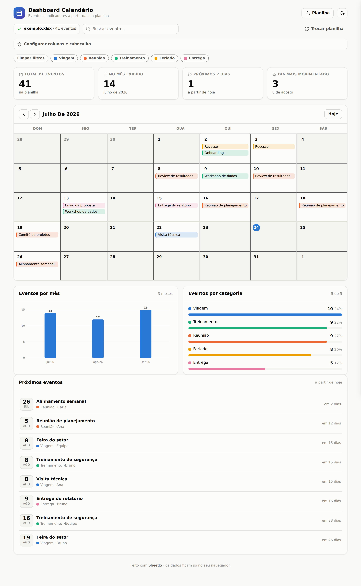

# Dashboard Calendário

Um **dashboard de calendário** que se monta sozinho a partir de uma planilha
Excel ou CSV. Você arrasta o arquivo e ele mostra os eventos num calendário
mensal, com indicadores (KPIs), gráficos e a lista dos próximos compromissos.

É um **site estático** — não precisa de servidor, banco de dados nem instalação.
Tudo roda no navegador e **nenhum dado sai do seu computador**.



---

## Como usar

1. Abra o arquivo `index.html` no navegador (duplo clique) **ou** acesse o site
   publicado (veja *Publicar num domínio* abaixo).
2. Clique em **Escolher planilha** ou **arraste** o arquivo `.xlsx`, `.xls` ou
   `.csv` para a tela.
3. Pronto — o calendário, os indicadores e os gráficos aparecem automaticamente.

Para testar sem uma planilha, clique em **“Ver com dados de exemplo”**.

### O que a planilha precisa ter

O dashboard **detecta as colunas sozinho**. O único requisito é ter uma **coluna
de datas**. As demais são opcionais, mas melhoram o resultado:

| Coluna | Obrigatória? | Para que serve |
|--------|:---:|----------------|
| **Data** | ✅ Sim | posiciona o evento no calendário |
| **Título / Evento** | recomendada | o texto que aparece no dia |
| **Categoria / Tipo** | opcional | cor dos eventos + gráfico por categoria + filtros |
| **Data final** | opcional | eventos que duram vários dias |
| Quaisquer outras | opcional | aparecem nos detalhes ao clicar no dia |

Detalhes que ele entende automaticamente:

- Datas em formato brasileiro (`24/07/2026`), ISO (`2026-07-24`), datas “de
  verdade” do Excel, e por extenso (`24 de julho de 2026`).
- Uma **linha de título** acima do cabeçalho (ex.: “Agenda 2026”) é ignorada.
- Várias **abas** — dá para escolher qual usar.

Se ele errar alguma coluna, use **“Configurar colunas e cabeçalho”** para
corrigir manualmente (inclusive a linha do cabeçalho).

---

## Recursos

- 📅 Calendário mensal com navegação e destaque do dia de hoje
- 📊 KPIs: total, eventos no mês, próximos 7 dias e dia mais movimentado
- 📈 Gráficos: eventos por mês e por categoria (ou por dia da semana)
- 🔎 Busca por texto e filtros por categoria
- 🗂️ Clique num dia para ver todos os eventos e seus detalhes
- 🌗 Tema claro/escuro
- 📱 Funciona no celular
- 💾 Lembra da última planilha carregada (fica salva só no seu navegador)

---

## Publicar num domínio

Como é um site estático, é só subir **a pasta inteira** do projeto. Opções fáceis:

- **Netlify / Vercel:** arraste a pasta na área de deploy, ou conecte este
  repositório do GitHub. O deploy é automático a cada mudança.
- **GitHub Pages:** nas configurações do repositório → *Pages* → publique a
  branch. O site fica em `https://<usuário>.github.io/<repo>/`.
- **Hospedagem própria do domínio (cPanel/FTP):** envie os arquivos para a pasta
  pública (ex.: `public_html`). O `index.html` precisa ficar na raiz.

Depois é só apontar seu domínio para o serviço escolhido.

> Os caminhos são todos relativos, então funciona tanto na raiz do domínio
> (`meudominio.com`) quanto numa subpasta (`meudominio.com/agenda/`).

---

## Estrutura do projeto

```
index.html               # a página
assets/styles.css        # estilos (tema claro/escuro, responsivo)
assets/app.js            # lógica: leitura da planilha, calendário, gráficos
vendor/xlsx.full.min.js  # biblioteca que lê o Excel (local, sem CDN)
```

Sem etapa de build, sem dependências de internet em tempo de execução.

---

## Privacidade

O processamento é 100% no navegador. A planilha **não é enviada para nenhum
servidor**. O “lembrar da última planilha” usa o armazenamento local do próprio
navegador (`localStorage`) e some quando você carrega outra planilha.

---

Feito com [SheetJS](https://sheetjs.com) para leitura de planilhas.
